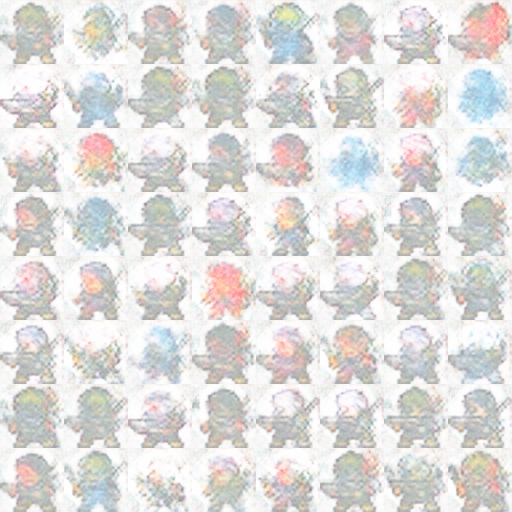

# dcgan_sprite_ai
Sprite generation tool using a DCGAN

## Pre-Requisite
You will need MSYS2 to at tun the needed scripts. 

* Nvidia Cuda Toolkit 11.7 or higher
* Nvidia CuDNN 8.0 or higher
* MSYS2 (https://www.msys2.org)
  * We used this to make and run my shell scripts. I have a simple auto_compile.sh script that should be ran from\n the MSYS64 shell on Windows
* CMake 3.23 or higher
* Visual Studio 2019 or higher
  * Can use CLion but will still need to use the Visual Studio compiler

#### Tested with on
* Windows 10, Windows 11
* AMD 5950x, Intel 13700k, Intel 12700k
* Nvidia RTX 4090, Nvidia RTX 4080, Nvidia RTX 3070

**Note:** Should run on other platforms I believe using the CPU but will not be GPU accelerated without a Nvidia GPU for now.

## How to compile (C++ application)
This can be done using cmake itself or by running the auto_compile.sh script in msys2 terminal

note: make sure to do a recursive checkout to get the submodules needed to bubild the c++ application

### Using auto_compile.sh
This script assumes visual studio 2022 is installed onto your computer but it will do the initial build and copy the necessary files to where the executable will be.

### Using cmake
If wanting to use cmake directly which could be useful if you do not have visual studio 2022 this is an option.

You will need to create a new directory called **build** (mkdir build). You will then need to cd into the build folder and call **cmake -G "Visual Studio <version> <year>" ..** . An
example of this would look like this...

**cmake -G "Visual Studio Visual Studio 17 2022" ..**

The cmake call will download the necessary pytorch files and extract them into *<project_root>/libs*

You will then need to build the application and you can do so in 2 ways.
1. Open the visual studio solution file (spriteai.sln) which will open Visual Studio IDE and you can build and code from there
2. call this on the terminal **cmake --build . --config debug/release** (you choose debug or release)
3. should also be able to open the project using CLion as well by opening project where the CMakeLists.txt file is though you need to make sure CLion is set to use the visual studio compiler

### Before you run
Need to have images in a folder data/creatures/images/ and an output folder called output_images which will hold the generated fake images as png files.

### Command Line Arguments

These are available for the C++ application for now. You should be able to the help menu...

**spriteai.exe --help**

# Python Application

The python implementation is under the papp folder. The script setup_env.bat file should be run under windows command line.
 
This will create a python virtual environment and install the needed modules for the python application to run. You'll know if this works if you see a basic tensor data output at the
end of the script.
  
This script will generate another script called activate_torch_env.bat that needs to be ran so that the pytorch modules will be recognized.

Before you run the script we need to have a **batch of sprite images which need to be inside a folder data/creatures/images.** You'll want at least 100+ sprites as we  ran into issues
if we didn't have enough images.
    
After this you should be able to run the script
  
  **python DCGAN.py**
  
**Note:** This tends to run slow as it seems like the data is not being ran on the GPU but rather only partially when it detects the GPU

## Sprite Data
We bought our sprite data but there's no reason you can't use whatever you can find. Here are some websites for sprite data. We don't add the data
to the repo because the files (all the images we use as a whole) tend to too big in file byte size.

Sprite Tiles (This is what the applications are expecting)
* https://github.com/PokeAPI/sprites
* https://github.com/YingzhenLi/Sprites

SpriteSheets (sprites would need to be separated into their image tile)
* https://www.spriters-resource.com/game_boy_advance/pokemonemerald/
* https://itch.io/game-assets/tag-8-bit/tag-sprites
* https://opengameart.org/content/sprites-2
* https://spritedatabase.net/

At the moment we don't have a tool that separates out the images from a single spreedsheet and we expect individual images
that make up each sprite for now.

### example

